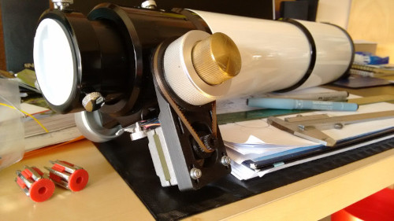
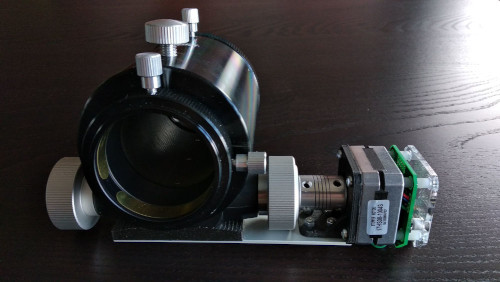
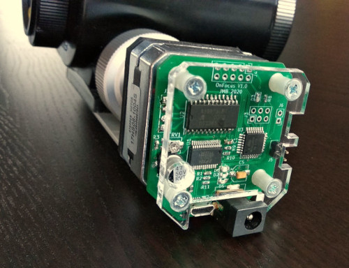

# onFocus

An Arduino-based **telescope focuser** that implements the Moonlite protocol.

You can build your focuser using the following components:
 * An [Arduino Nano](https://store.arduino.cc/arduino-nano).
 * An [EasyDriver](https://www.sparkfun.com/products/12779) module.
 * A standard NEMA 17 stepper motor.
 * A limit switch connected between pin 9 and GND (Optional)

Also you will need some mechanical stuff:
 * An enclosure for the electronics
 * Some kind of mechanical coupling between the motor and your telescope's focuser

Watch some [pictures of working implementations](#pictures).

Inspired by [Orly Andico's project](http://orlygoingthirty.blogspot.co.nz/2014/04/arduino-based-motor-focuser-controller.html).

## Usage

Using [PlatformIO Core](https://platformio.org/):

Build the code:

    $ pio run

Upload the firmware to an Arduino Nano:

    $ pio run -t upload

The serial port is defined in the `platformio.ini` file.
By default it is `/dev/ttyUSB0`.
If your board is connected through a different port, edit that file or pass the
port to the `run` command like this:

    $ pio run -t upload --upload-port /dev/ttyUSB1

If your Arduino has the [new bootloader](https://docs.platformio.org/en/latest/boards/atmelavr/nanoatmega328new.html)
you have to use the `nano328new` environment:

    $ pio run -e nano328new
    $ pio run -e nano328new -t upload

## Arduino pins

| Number | Description                    | 
|--------|--------------------------------| 
| 2      | EasyDriver **MS1** pin         |
| 3      | EasyDriver **MS2** pin         |
| 4      | EasyDriver **Enable** pin      |
| 5      | EasyDriver **Dir** pin         |
| 6      | EasyDriver **Step** pin        |
| 7      | EasyDriver **Reset** pin       |
| 9      | Limit switch                   |

## Pictures

### Example 1

* NEMA 17 motor attached to the focuser using a custom 3D printed part.
* Timing belts.

### Example 2

* Custom PCB board integrating the Arduino Nano and the EasyDriver in a smaller area.
* Laser-cut acrylic cover.
* Motor attached to the focuser using a flexible shaft coupler.

